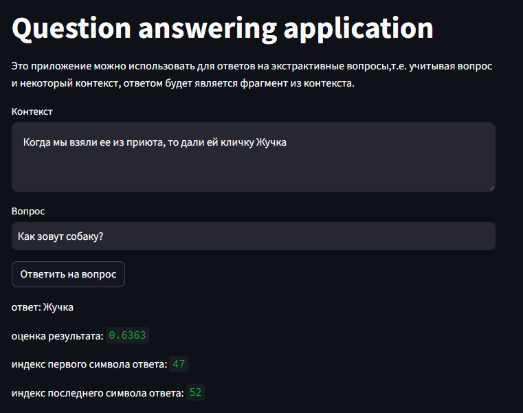
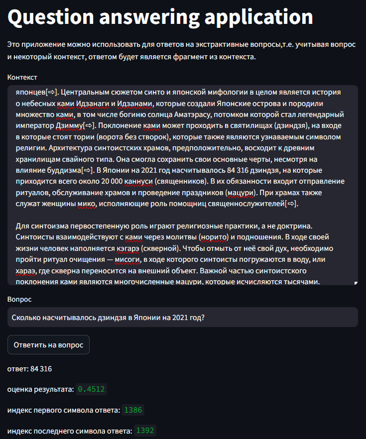

# Question answering application
---
## Назначение приложения
Это приложение можно использовать для ответов на экстрактивные вопросы,\
т.е. учитывая вопрос и некоторый контекст, ответом будет является фрагмент из контекста.
### Примененная модель машинного обучения
Применена готовая модель https://huggingface.co/AndrewChar/model-QA-5-epoch-RU. \
Выбор модели в первую очередь обусловлуен ее малым размером.

---
[Запустить приложение](https://questionanswerer.streamlit.app)

---
### Скриншоты рабочего приложения:

